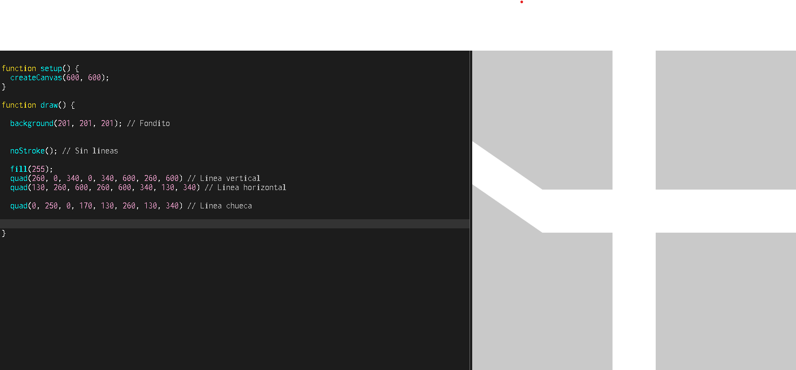
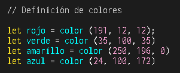
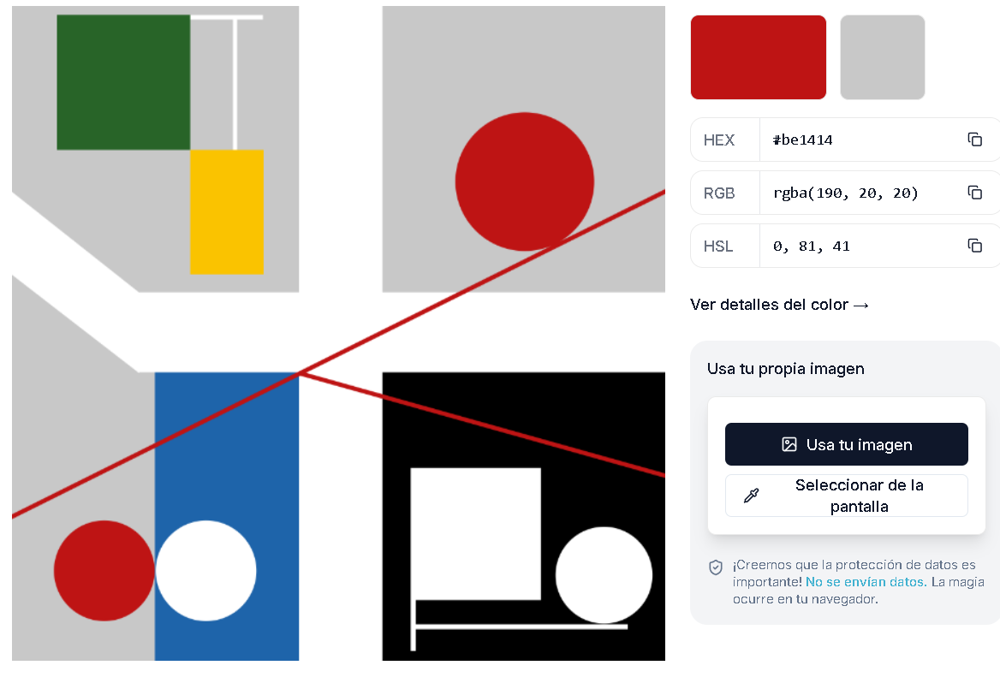

# Pensamiento-computacional.s3
## Sobre este repositorio
Esta bitacora tiene el proposito de informar sobre mi proceso a la hora de aprender la pagina p5.js, ademas de mostrar la solemne n°1. c:

## Sketch 1 - Mi primer p5.js:
- ¿Qué intenté hacer? Lo que intente realizar y practicar eran los circulos, intente hacer un payaso y ver mas herramientas por ejemplo una curva se hace asi -> bezier(x1, y1, x2, y2, x3, y3, x4, y4) sinceramente no me salio y lo deje aparte, pero logre hacer el payaso con las herramientas que ya son lo minimo.
- ¿Qué aprendí? Quizas no aprendi a realizar nuevos codigos, pero si aprendi a controlar las formas minimas como el triangulo y el circulo, tambien a controlar donde quiero la forma (x e y) y los colores.
- ¿Qué no salió? Siento que no me salio lo de los ojos y la boca, quizas con mas codigos se puedan llegar a ver bien.

[P5.js Sketch](https://editor.p5js.org/Tusso/sketches/pjg0-j0mW)

## Solemne n°1 - Replica de Sophie Taeuber-Arp:

*(Este encargo lo empece una semana antes de que realmente se diera porque me gusto esto de mini programar y en la ultima clase agregue algunas cosas que aprendimos ese dia)*

- ¿Como elegi la obra? Esta obra la escogi porque estaba pues intentando encontrar alguna que sean formas limpias y con herramientas que ya haya aprendido a usar (obviamente que tengan su dificultad) y encontre a esta diseñadora Sophie Taeuber-Arp, tiene bastantes obras pero la que mas me llamo la atencion fue la que realice, mas que por su dificultad fue por los colores que tiene y la ubicacion de las formas, supe que ahi tendria algo que me pondria a prueba.
- ¿Como la analice? Empece a verle el tamaño, la obra mide 1600x1599, lo reduje a 600x600 para tener mas control de las ubicaciones, luego fui con los colores, encontre una pagina gratis ([image picker](https://imagecolorpicker.com/es#google_vignette)) donde podia sacar el codigo hex/rgb/hsl del color que se veia en la imagen,la obra tiene una imagen donde los colores se ven mas solidos y esa ocupe porque la obra original no tiene un color exacto. Luego tenia que pensar por donde empezaria, obviamente por el fondo, de ahi luego empece por el lado izquierdo de arriba, luego derecho, luego abajo a la derecha y despues al ultimo abajo a la izquierda, tambien las lineas que van por encima (las rojas) y listo.
- ¿Como traduje las coordenadas? Como empece de antes no sabia realmente que se podia hacer en photoshop, asi que simplemente fui jugando con el x e y hasta que se viera realmente igual a la obra, como no habia practicado tanto a veces me confundia de que esquina queria realmente mover.
- ¿Que dificultades tuve? Lo complicado de esto fue aprender que (x, y) mueve tal esquina, al ya jugar bastante con los primeros rectangulos que hice aprendi que van en sentido horario, tambien fue complicado hacer las lineas porque no se podian hacer con line() porque tienen el final redondeado, y las lineas que hace Sophie en esta obra son rectas, entonces tuve que hacerlas con quad() y mover cada esquina de eso ademas de estar aprendiendo pero a la vez jugando fue algo complicado.
- ¿Como los resolvi? Mantuve la calma, en vez de estar estresada realizandolo, estuve bien porque realmente me gusto esta materia, es facil cuando realmente la entiendes, los problemas que tuve no fueron tantos ademas de que alguna esquina se me iba muy alla, jugar con los puntos y que queria que algunos sean demasiado exactos porque no se veian perfectos en un numero mas alla. La verdad soy muy perfeccionista y no podia soportar que este un pixel corrido, pero ya al terminar me gusto lo que hice y quede conforme con lo que aprendi. c:

[P5.js Solemne](https://editor.p5js.org/Tusso/sketches/NYPvrUb5P)

**Codigo de fondo de la obra**

**Definicion de colores añadida el 03/04**

**Image picker con la obra de colores exactos**

La obra fue recreada por Myriam Thyes en 2017.
[WikiMyriamThyes](https://commons.wikimedia.org/wiki/File:Taeuber-Arp-quatre-espaces-a-cercles-rouges-roulants-1932-gouache-papier.svg)

**Obra de Sophie Taeuber-Arp Original** *"Quatre espacs á cercles rouges roulants" (1932) (Four spaces with red rolling circles)*

**REPLICA de Sophie Taeuber**

