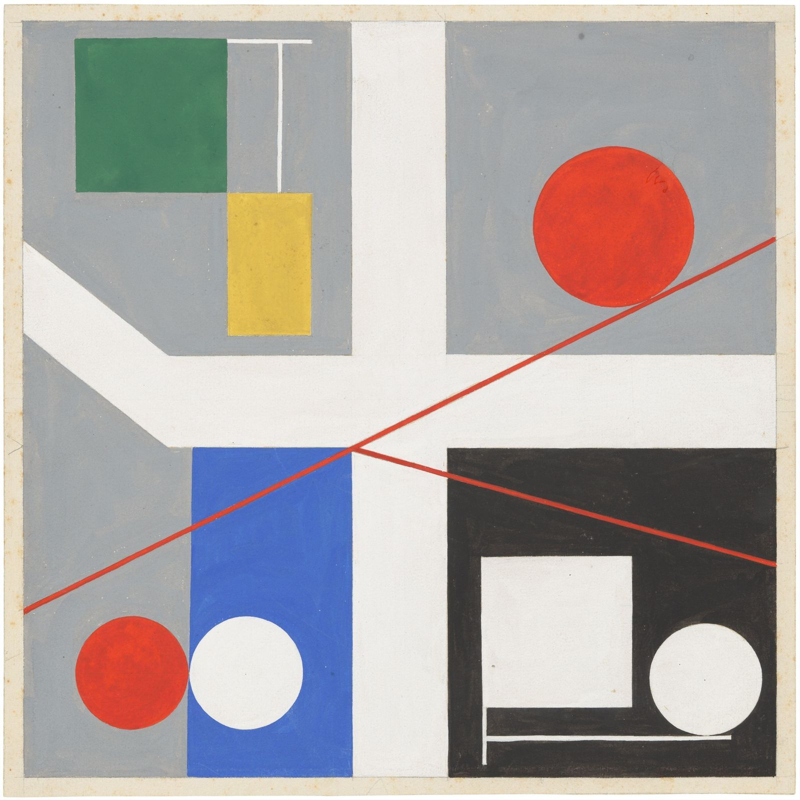
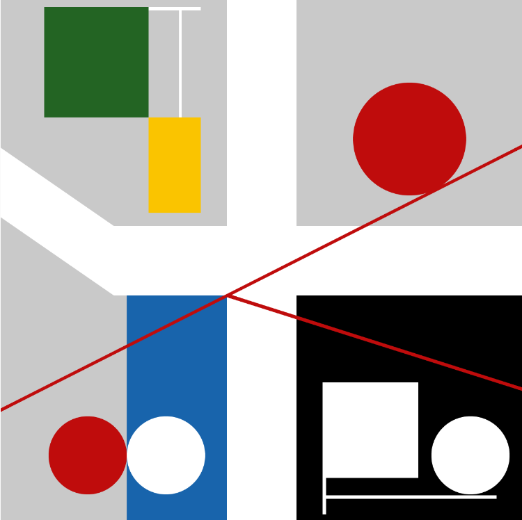

# Pensamiento-computacional.s3
## Sobre este repositorio
Esta bitacora tiene el proposito de informar sobre mi proceso a la hora de aprender la pagina p5.js, ademas de mostrar la solemne n°1. c:

## Sketch 1 - Mi primer p5.js:
- ¿Qué intenté hacer? Lo que intente realizar y practicar eran los circulos, intente hacer un payaso y ver mas herramientas por ejemplo una curva se hace asi -> bezier(x1, y1, x2, y2, x3, y3, x4, y4) sinceramente no me salio y lo deje aparte, pero logre hacer el payaso con las herramientas que ya son lo minimo.
- ¿Qué aprendí? Quizas no aprendi a realizar nuevos codigos, pero si aprendi a controlar las formas minimas como el triangulo y el circulo, tambien a controlar donde quiero la forma (x e y) y los colores.
- ¿Qué no salió? Siento que no me salio lo de los ojos y la boca, quizas con mas codigos se puedan llegar a ver bien.

[P5.js](https://editor.p5js.org/Tusso/sketches/pjg0-j0mW)

## Solemne n°1 - Replica de Sophie Taeuber:

*(Este encargo lo empece una semana antes de que realmente se diera porque me gusto esto de mini programar y en la ultima clase agregue algunas cosas que aprendimos ese dia)*

- ¿Como elegi la obra?
- ¿Como la analice?
- ¿Como traduje las coordenadas?
- ¿Que dificultades tuve?
- ¿Como los resolvi?

[P5.js](https://editor.p5js.org/Tusso/sketches/NYPvrUb5P)

**Obra de Sophie Taeuber Original** *"Quatre espacs á cercles rouges roulants" (1932)*

**REPLICA de Sophie Taeuber**

